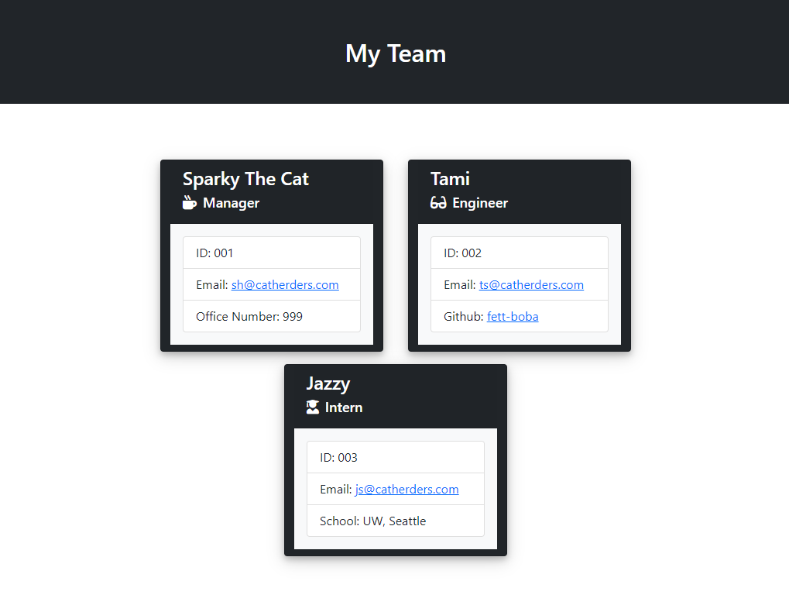

# Week10-OOP-Team-Profile-Generator

## Description
- This is a Command Line application that accepts user input to build an Employee Team Roster.
- It will prompt the user for roles (Manager, Engineer, Intern)
- Employee name, ID, and email will be entered for each role.
- In addition, Manager office number, Engineer Github ID, and Intern's school will be entered.
- When employee email is clicked, the default email program will open.
- When Github ID is clicked, the Github profile will open in a new tab.

## Usage

- Run application via "node index.js" from the command line.
- An HTML file with the formatted Team Profile will be generated in ./dist/index.html

## Tests

- JEST tests exist for all objects (Employee, Manager, Engineer, Intern) to insure they return expected results for each method.
- Located in ./_tests_ folder

## Demo/Walkthrough Video

- Video demo/walkthrough available here: [https://youtu.be/JBu2R8VMCPA](https://youtu.be/JBu2R8VMCPA)

## Screenprints 
 

---
